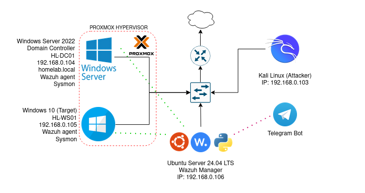
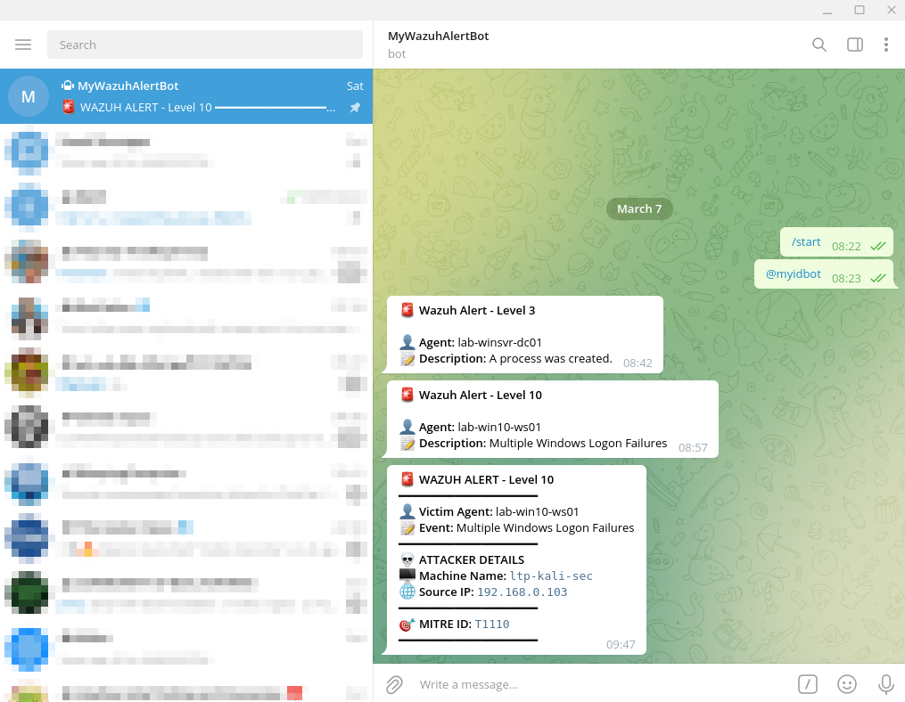
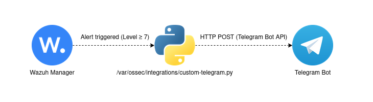

# Wazuh → Telegram Real-Time Alert Integration 🛡️

A custom integration for **Wazuh SIEM** that forwards security alerts to a **Telegram Bot** in real time. Designed for home labs and small environments to gain instant mobile visibility into security events — with attacker IP, machine name, and MITRE ATT&CK context.




> 📸 **Live Alert Example:**
> ```
> 🚨 WAZUH ALERT - Level 10
> ━━━━━━━━━━━━━━━━━━━━
> 👤 Victim Agent: Windows-10-Client
> 📝 Event: Multiple Windows logon failures
> ━━━━━━━━━━━━━━━━━━━━
> 💀 ATTACKER DETAILS
> 🖥️ Machine Name: KALI-LINUX-VM
> 🌐 Source IP: 192.168.0.22
> ━━━━━━━━━━━━━━━━━━━━
> 🎯 MITRE ID: T1110
> ━━━━━━━━━━━━━━━━━━━━
> ```



---

## 🚀 Features

- **Real-Time Alerts** — Notified on your phone the moment a threat is detected.
- **Attacker Context** — Extracts attacker IP and machine name from Windows security events (Event ID 4625).
- **MITRE ATT&CK Mapping** — Includes technique IDs (e.g., `T1110` — Brute Force) from Wazuh's built-in MITRE data.
- **Noise Filtering** — Configurable alert level threshold so only meaningful threats reach you.
- **Zero External Dependencies** — Uses Wazuh's native integration framework; no third-party middleware needed.

---

## 🏗️ Architecture





---

## 🛠️ Prerequisites

| Requirement | Notes |
|---|---|
| [Wazuh Manager](https://wazuh.com/) | Installed on Ubuntu (tested on 4.x) |
| Telegram Account | For receiving alerts |
| Telegram Bot | Created via [@BotFather](https://t.me/botfather) |
| Python 3 | Pre-installed on most Ubuntu systems |
| `requests` library | `pip3 install requests` |

---

## 📂 Repository Structure

```
wazuh-telegram-integration/
│
├── README.md                          # This file
│
├── scripts/
│   ├── custom-telegram.py             # v1 — Basic alert script (initial version)
│   └── custom-telegram-v2.py          # v2 — Enhanced with attacker details & MITRE IDs
│
└── docs/
    ├── create-telegram-bot.md      # Phase 1: Set up your Telegram Bot
    └── integration-wazuh-config.md  # Phase 2 & 3: Deploy & configure
```

---

## ⚡ Quick Start

### Step 1 — Create Your Telegram Bot
Follow **[Phase 1: Create Your Telegram Bot](docs/create-telegram-bot.md)** to get your `TOKEN` and `CHAT_ID`.

### Step 2 — Deploy the Script
```bash
sudo nano /var/ossec/integrations/custom-telegram.py
```
Copy the contents of [`scripts/custom-telegram-v2.py`](scripts/custom-telegram-v2.py) and replace the credentials:
```python
CHAT_ID = "YOUR_CHAT_ID_HERE"
TOKEN   = "YOUR_BOT_TOKEN_HERE"
```

### Step 3 — Set Permissions
```bash
sudo chown root:wazuh /var/ossec/integrations/custom-telegram.py
sudo chmod 750 /var/ossec/integrations/custom-telegram.py
```

### Step 4 — Configure Wazuh
Add to `/var/ossec/etc/ossec.conf` (inside `<ossec_config>`):
```xml
<integration>
  <n>custom-telegram.py</n>
  <level>7</level>
  <alert_format>json</alert_format>
</integration>
```

### Step 5 — Restart & Test
```bash
sudo systemctl restart wazuh-manager

# Manual test
sudo tail -n 1 /var/ossec/logs/alerts/alerts.json > /tmp/test_alert.json
sudo /var/ossec/integrations/custom-telegram.py /tmp/test_alert.json
```

---

## 📖 Detailed Documentation

| Document | Description |
|---|---|
| [01 — Create Telegram Bot](docs/create-telegram-bot.md) | BotFather setup, API token, Chat ID |
| [02 — Integration & Config](docs/integration-wazuh-config.md) | Script deployment, ossec.conf, testing |

---

## 🔄 Script Version History

| Version | File | Description |
|---|---|---|
| v1 | `scripts/custom-telegram.py` | Basic alert: level, description, agent name |
| v2 | `scripts/custom-telegram-v2.py` | Enhanced: attacker IP, machine name, MITRE ATT&CK IDs, improved formatting |

---

## 🔒 Security Notes

> ⚠️ **Never commit your real `TOKEN` or `CHAT_ID` to a public repository.**

- All credential fields in this repository use placeholder values (`YOUR_*_HERE`).
- Consider storing credentials in environment variables or a config file excluded via `.gitignore` for production use.

---

## 🧪 Lab Environment

This integration was built and tested in a home lab with:
- **Wazuh Manager** on Ubuntu Server
- **Windows 10** endpoint agent
- **Kali Linux** as the attack machine (brute-force simulation via `hydra`)

---

## 📜 License

This project is open source and available under the [MIT License](LICENSE).

---

## 🙋 Author

Built as part of a cybersecurity home lab portfolio.  
Feel free to fork, improve, and share!
